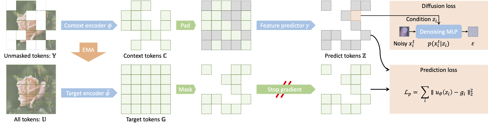

# Denoising with a Joint-Embedding Predictive Architecture (D-JEPA)

Welcome to the official repository for the paper "Denoising with a Joint-Embedding Predictive Architecture" (D-JEPA). This repository contains the implementation of the methods described in the paper.

Since the paper is currently under anonymous review, some links that might reveal author information have been hidden.

## Abstract

Joint-embedding predictive architectures (JEPAs) have shown substantial promise in self-supervised representation learning, yet their application in generative modeling remains underexplored. Conversely, diffusion models have demonstrated significant efficacy in modeling arbitrary probability distributions. In this paper, we introduce Denoising with a Joint-Embedding Predictive Architecture (D-JEPA), pioneering the integration of JEPA within generative modeling. By recognizing JEPA as a form of masked image modeling, we reinterpret it as a generalized next-token prediction strategy, facilitating data generation in an auto-regressive manner. Furthermore, we incorporate diffusion loss to model the per-token probability distribution, enabling data generation in a continuous space. We also adapt flow matching loss as an alternative to diffusion loss, thereby enhancing the flexibility of D-JEPA. Empirically, with increased GFLOPs, D-JEPA consistently achieves lower FID scores with fewer training epochs, indicating its good scalability. Our base, large, and huge models outperform all previous generative models across all scales on class-conditional ImageNet benchmarks. Beyond image generation, D-JEPA is well-suited for other continuous data modeling, including video and audio.

## Paper

The full paper can be accessed [here](#). 

## Code

The code implementation of the methods described in the paper can be found [here](#).

## Examples on ImageNet

## Examples on LJSpeech-1.1

